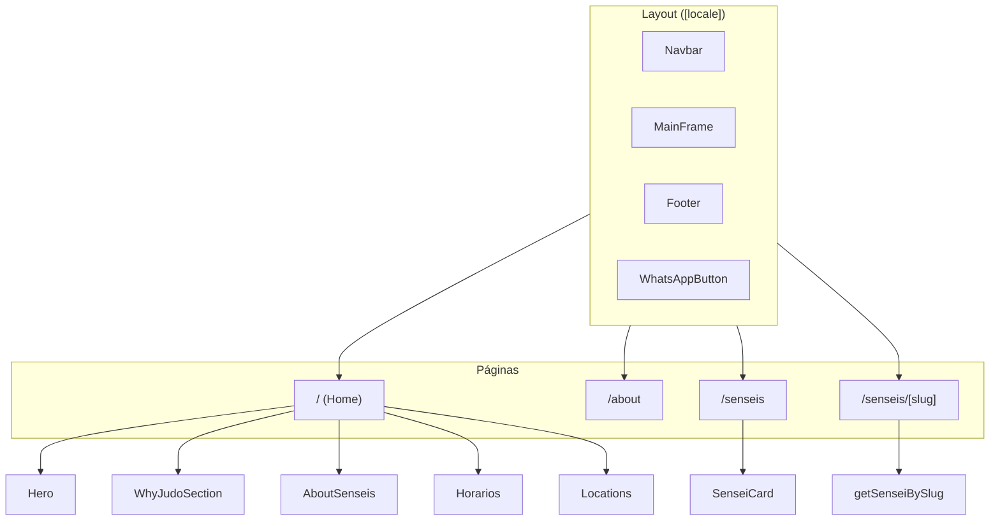

# Mapa del App — Judo San Pedro

Mapa de rutas, componentes y datos de la aplicación Next.js (App Router) con i18n (es/en).

---

## 1. Rutas (App Router)

Todas las rutas están bajo `[locale]` (es | en).

```
/                           → Home
/es                         → Home (español)
/en                         → Home (inglés)
/[locale]/about             → Sobre nosotros (página básica)
/[locale]/senseis           → Listado de senseis
/[locale]/senseis/[slug]    → Ficha de un sensei (ej: /es/senseis/david)
```

### Resumen por carpeta

| Ruta en filesystem | URL | Descripción |
|--------------------|-----|-------------|
| `app/[locale]/layout.tsx` | — | Layout global: Navbar, MainFrame, Footer, WhatsAppButton |
| `app/[locale]/page.tsx` | `/{locale}` | Página de inicio |
| `app/[locale]/about/page.tsx` | `/{locale}/about` | Sobre nosotros |
| `app/[locale]/senseis/page.tsx` | `/{locale}/senseis` | Lista de senseis |
| `app/[locale]/senseis/[slug]/page.tsx` | `/{locale}/senseis/:slug` | Detalle de sensei |

---

## 2. Diagrama de rutas (Mermaid)



---

## 3. Componentes y uso por página

### Layout (siempre visibles)

| Componente | Ubicación | Uso |
|------------|-----------|-----|
| `Navbar` | `components/Navbar.tsx` | Navegación, logo, links (Home, Senseis, Horarios, Ubicación) |
| `MainFrame` | `components/layout/MainFrame.tsx` | Contenedor centrado para el contenido |
| `Footer` | `components/Footer.tsx` | Pie de página |
| `WhatsAppButton` | `components/WhatsAppButton.tsx` | Botón flotante WhatsApp |

### Home (`/`)

| Componente | Descripción |
|------------|-------------|
| `Hero` | Sección principal con imagen y mensaje |
| `HeroContent` | Contenido interno del hero (si se usa) |
| `WhyJudoSection` | Sección “Por qué Judo” |
| `WhyJudoCards` | Tarjetas dentro de WhyJudo |
| `AboutSenseis` | Bloque “Nuestros senseis” en home |
| `AboutSenseiInfo` | Info de sensei en AboutSenseis |
| `Horarios` | Horarios de clases |
| `HorarioDia` | Un día dentro de Horarios |
| `Locations` | Mapa/ubicación del dojo |

### Senseis

| Componente | Página | Descripción |
|------------|--------|-------------|
| `SenseiCard` | `/senseis` | Tarjeta de sensei en el listado |
| `SenseiCardInfo` | (usado en SenseiCard) | Detalle en la tarjeta |
| Detalle sensei | `/senseis/[slug]` | Contenido en `app/[locale]/senseis/[slug]/page.tsx` (sin componente nombrado) |

### Otros

| Componente | Uso |
|------------|-----|
| `ContactUs` | Formulario o bloque de contacto (si se usa en alguna página) |

---

## 4. Datos (`data/`)

| Archivo | Contenido |
|---------|-----------|
| `data/i18n/index.ts` | Exporta `i18n`, `Locale`, `locales` (es, en) |
| `data/i18n/es.ts` | Textos en español |
| `data/i18n/en.ts` | Textos en inglés |
| `data/senseis/senseis.ts` | Lista de senseis, `getSenseiBySlug(slug)` |
| `data/horarios/horarios.ts` | Datos de horarios |

---

## 5. Flujo de idioma

- **Locale:** `es` | `en` (definido en `data/i18n`).
- La primera parte de la URL es el locale: `/{locale}/...`.
- Layout y páginas reciben `params.locale` y usan `i18n[locale]` para los textos.
- Navbar y Footer reciben `locale` para generar links con `/${locale}/...`.

---

## 6. Estructura de carpetas (resumida)

```
judosanpedro/
├── app/
│   ├── [locale]/
│   │   ├── layout.tsx      # Layout global
│   │   ├── page.tsx        # Home
│   │   ├── globals.css
│   │   ├── about/page.tsx
│   │   └── senseis/
│   │       ├── page.tsx
│   │       └── [slug]/page.tsx
│   └── favicon.ico
├── components/
│   ├── layout/MainFrame.tsx
│   ├── senseis/            # SenseiCard, AboutSenseis, etc.
│   ├── Navbar.tsx, Footer.tsx, Hero.tsx, Horarios.tsx, ...
│   └── WhatsAppButton.tsx
├── data/
│   ├── i18n/               # es, en, index
│   ├── senseis/senseis.ts
│   └── horarios/horarios.ts
├── public/                 # logo, imágenes, hero, senseis
└── docs/
    └── MAPA_DEL_APP.md     # Este archivo
```

---

## 7. Navegación (Navbar)

Links actuales (según `Navbar.tsx`):

- **Inicio** → `/{locale}`
- **Senseis** → `/{locale}/senseis`
- **Horarios** → `/{locale}#horarios`
- **Ubicación** → `/{locale}#ubicacion`

*(About está comentado en los links pero la ruta `/about` sigue existiendo.)*

---

*Última actualización: febrero 2025*
